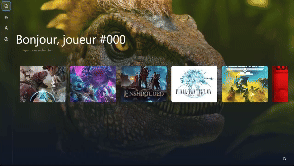

# GLaunch

GLaunch is a modern, cross-platform game launcher built with Tauri and Vue.js. It provides a unified interface to manage and launch games from different platforms like Steam, Epic Games, and Battle.net. With its sleek design and keyboard-first navigation, GLaunch offers a seamless gaming experience.



## 🎮 Features

### Platform Integration
- Steam library integration with automatic game detection
- Battle.net games support with authentication
- Epic Games Store integration
- Custom games folder support
- Automatic metadata fetching from IGDB
- Real-time game session tracking

### User Experience
- Keyboard-first navigation system
- Custom overlay system for in-game information
- Multiple view modes (grid/list)
- Game search and filtering
- Genre and tag-based organization
- Minimalist design with dark mode

### Technical Features
- Automatic updates with built-in updater
- Tray icon support with minimize functionality
- Windows startup integration
- Customizable settings
- Database import/export functionality
- System tray integration
- Games statistics tracking
- Media caching system

## 🚀 Development Setup

### Prerequisites
- Node.js (v18 or higher)
- Rust (latest stable)
- pnpm package manager
- Visual Studio Build Tools (Windows)

### Environment Variables
Create a `.env` file in the root directory with:
```env
STEAM_API_KEY=your_steam_api_key
EPIC_CLIENT_ID=your_epic_client_id
EPIC_CLIENT_SECRET=your_epic_client_secret
BATTLENET_CLIENT_ID=your_battlenet_client_id
BATTLENET_CLIENT_SECRET=your_battlenet_client_secret
IGDB_CLIENT_ID=your_igdb_client_id
IGDB_CLIENT_SECRET=your_igdb_client_secret
```

### Installation
1. Clone the repository:
```bash
git clone https://github.com/yourusername/glaunch.git
cd glaunch
```

2. Install dependencies:
```bash
pnpm install
```

3. Run the development server:
```bash
pnpm tauri dev
```

### Build
To create a production build:
```bash
pnpm tauri build
```

## 📦 CI/CD Pipeline

Here's the GitHub Actions workflow for building and releasing GLaunch:

```yaml
name: Release

on:
  push:
    tags:
      - 'v*'

env:
  STEAM_API_KEY: ${{ secrets.STEAM_API_KEY }}
  EPIC_CLIENT_ID: ${{ secrets.EPIC_CLIENT_ID }}
  EPIC_CLIENT_SECRET: ${{ secrets.EPIC_CLIENT_SECRET }}
  BATTLENET_CLIENT_ID: ${{ secrets.BATTLENET_CLIENT_ID }}
  BATTLENET_CLIENT_SECRET: ${{ secrets.BATTLENET_CLIENT_SECRET }}
  IGDB_CLIENT_ID: ${{ secrets.IGDB_CLIENT_ID }}
  IGDB_CLIENT_SECRET: ${{ secrets.IGDB_CLIENT_SECRET }}

jobs:
  release:
    strategy:
      matrix:
        platform: [windows-latest]

    runs-on: ${{ matrix.platform }}
    steps:
      - name: Checkout repository
        uses: actions/checkout@v4

      - name: Install Node.js
        uses: actions/setup-node@v4
        with:
          node-version: 20

      - name: Install Rust
        uses: actions-rs/toolchain@v1
        with:
          toolchain: stable
          profile: minimal
          override: true

      - name: Install pnpm
        uses: pnpm/action-setup@v2
        with:
          version: latest

      - name: Get version from tag
        id: get_version
        run: echo "VERSION=${GITHUB_REF#refs/tags/v}" >> $GITHUB_ENV

      - name: Install dependencies
        run: pnpm install

      - name: Build
        run: pnpm tauri build

      - name: Create Release
        uses: softprops/action-gh-release@v1
        with:
          name: GLaunch v${{ env.VERSION }}
          draft: false
          prerelease: false
          files: |
            src-tauri/target/release/bundle/msi/*.msi
            src-tauri/target/release/bundle/nsis/*.exe
        env:
          GITHUB_TOKEN: ${{ secrets.GITHUB_TOKEN }}

      - name: Generate changelog
        id: changelog
        uses: scottbrenner/generate-changelog-action@master
        env:
          REPO: ${{ github.repository }}

      - name: Update Release Notes
        uses: softprops/action-gh-release@v1
        with:
          body: |
            ## What's Changed
            ${{ steps.changelog.outputs.changelog }}
        env:
          GITHUB_TOKEN: ${{ secrets.GITHUB_TOKEN }}
```

## 📝 Contributing
Contributions are welcome! Please read our [Contributing Guidelines](CONTRIBUTING.md) before submitting a pull request.

## 📜 License
This project is licensed under the MIT License - see the [LICENSE](LICENSE) file for details.